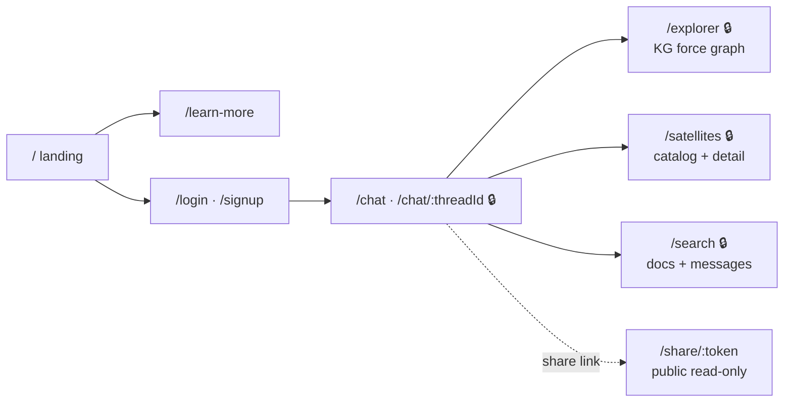

# 🛰️ Astra-Q Frontend

[](../../actions/workflows/frontend-ci.yml)


Space-themed web app for **Astra-Q** — an AI assistant for ISRO's MOSDAC satellite data. Chat with hybrid RAG + knowledge-graph answers, explore the satellite knowledge graph visually, browse the satellite catalog, and search the document corpus semantically.

> The API lives in the companion repo **AstraQ_Backend** — FastAPI + FAISS + Neo4j + Gemini.

## Pages



- **Chat** — markdown answers with collapsible source citations and mode badges (KG / documents / both), AI-generated follow-up chips, voice input, file attachments (txt/pdf/docx), favorites, Markdown export, public share links.
- **KG Explorer** — interactive force-directed graph of the Neo4j knowledge graph (react-force-graph-2d, lazy-loaded): type filters, search-to-focus, node detail panel with connections, deep links into chat.
- **Satellites** — glass-card catalog with per-satellite detail pages (products, parameters, regions, payloads) and an "Ask Astra-Q about this" shortcut.
- **Global Search** — debounced semantic search over the MOSDAC corpus with relevance scores, plus a personal message-history tab.
- **Share** — public, no-login read-only view of a shared conversation.

## Stack

- **React 19** + **TypeScript (strict)** + **Vite 7** (SWC)
- **Tailwind CSS v4** via `@tailwindcss/vite` — design tokens in `src/index.css` (`@theme`); the space/glassmorphism look is a pair of `glass` utilities
- **Framer Motion** for page transitions, staggered reveals, and micro-interactions
- **Firebase Auth** (email/password) — ID tokens auto-attached to API calls
- **lucide-react** icons, **react-markdown** + remark-gfm for answers
- **Vitest** + Testing Library (31 tests)

## Quickstart

```bash
npm ci
cp .env.example .env    # Firebase web config; API defaults to the dev proxy

npm run dev             # http://localhost:5173 — proxies /api → 127.0.0.1:8000
```

Run the backend locally (see AstraQ_Backend) for a working chat; the UI degrades gracefully when the API is down.

```bash
npm run typecheck   # tsc -b
npm run lint        # eslint (typescript-eslint flat config)
npm run test        # vitest
npm run build       # typecheck + production build to dist/
```

## Configuration

| Variable | Dev | Production |
|---|---|---|
| `VITE_API_BASE_URL` | omit (Vite proxies `/api`) | `https://<backend>.onrender.com/api` |
| `VITE_FIREBASE_*` | Firebase Console → Project settings → Web app | same |

All `VITE_*` values are baked in at build time; the Firebase web config is public by design (security is enforced server-side).

## Project structure

```
src/
  lib/            # typed API client (ApiError, rate-limit aware), firebase, shared types
  context/        # AuthContext (Firebase session + token provider)
  hooks/          # useSpeech (voice input), useWakeBackend (cold-start banner)
  components/
    ui/           # Button, Input, Modal, GlassPanel, Spinner, Badge, WakeBanner
    layout/       # Navbar, AppShell, SpaceBackground (pure CSS starfield)
    landing/      # Hero, Features, Services, FAQ, Footer
  features/
    chat/         # sidebar, messages, input, follow-up chips, export, share, modals, hooks
    kg/           # GraphExplorer (lazy chunk) + node color tokens
  pages/          # one component per route
```

Bundle discipline: route-level `React.lazy` for data pages, manual vendor chunks (react / firebase / motion / markdown), and the force-graph library isolated in its own chunk — the main bundle is ~85 KB gzipped.

## Deployment (Render Static Site)

Build `npm ci && npm run build`, publish `dist/`, SPA rewrite `/* → /index.html`, and set the env vars above. Full walkthrough (both repos + Firebase console steps): `docs/DEPLOYMENT.md` in the backend repo.

The backend sleeps on the free tier; `useWakeBackend` pings it on page load and shows a "warming up" banner during cold starts.

## Contributing

See [CONTRIBUTING.md](CONTRIBUTING.md).
