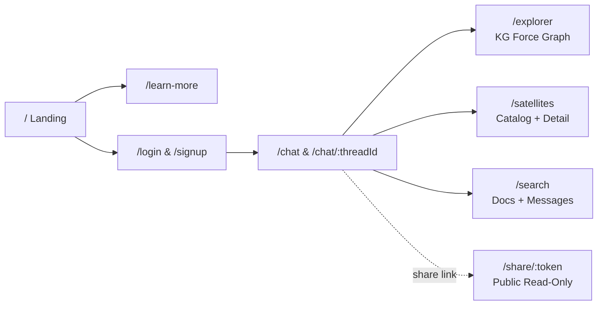

<p align="center">
  
</p>

<h1 align="center">AstraQ Frontend</h1>

<p align="center">
  <strong>AI-Powered Satellite Data Intelligence Interface</strong>
</p>

<p align="center">
  <a href="../../actions/workflows/frontend-ci.yml"></a>
  
  
  
  
  
</p>

<p align="center">
  A modern, space-themed web application for <strong>AstraQ</strong> — an AI assistant that provides intelligent access to ISRO's MOSDAC satellite datasets through natural language conversation, knowledge graph exploration, and semantic document search.
</p>

<p align="center">
  <a href="#features">Features</a> &bull;
  <a href="#tech-stack">Tech Stack</a> &bull;
  <a href="#getting-started">Getting Started</a> &bull;
  <a href="#project-structure">Project Structure</a> &bull;
  <a href="#deployment">Deployment</a> &bull;
  <a href="#contributing">Contributing</a>
</p>

---

## Features

### Conversational AI Chat
- Markdown-rendered answers with collapsible source citations and retrieval mode badges (KG / RAG / Both)
- AI-generated follow-up question chips for guided exploration
- Voice input via Web Speech API for hands-free querying
- File attachments (PDF, DOCX, TXT) for custom context grounding
- Thread management with favorites, full-text export (Markdown/JSON), and public share links

### Knowledge Graph Explorer
- Interactive force-directed graph visualization of the Neo4j satellite knowledge graph
- Type-based filtering, search-to-focus, and node detail panels with relationship traversal
- Deep linking into chat for contextual follow-up questions

### Satellite Catalog
- Browsable catalog of Indian Earth-observation satellites with category filtering
- Per-satellite detail pages showing products, parameters, regions, payloads, and inline document viewer
- "Ask AstraQ" shortcuts for instant contextual queries

### Global Search
- Debounced semantic search over the MOSDAC documentation corpus with relevance scoring
- Personal message history search across all conversation threads
- Direct navigation to source documents and chat threads

### Additional Capabilities
- Fully responsive design (mobile, tablet, desktop) with glassmorphism UI
- Dark-mode space theme with animated starfield background
- Public read-only conversation sharing (no authentication required)
- Cold-start detection with automatic backend warm-up banner
- Route-level code splitting for optimal loading performance

## Tech Stack

| Layer | Technology |
|-------|-----------|
| Framework | React 19 + TypeScript (strict mode) |
| Build | Vite 7 with SWC |
| Styling | Tailwind CSS v4 (`@tailwindcss/vite`) — custom design tokens via `@theme` |
| Animations | Framer Motion (page transitions, staggered reveals, micro-interactions) |
| Auth | Firebase Authentication (email/password) with auto-attached ID tokens |
| Icons | lucide-react |
| Markdown | react-markdown + remark-gfm |
| Graph Viz | react-force-graph-2d (lazy-loaded) |
| Testing | Vitest + Testing Library |
| Linting | ESLint (typescript-eslint flat config) |

## Getting Started

### Prerequisites

- Node.js 18+ and npm 9+
- A Firebase project with Authentication enabled (email/password provider)
- The [AstraQ Backend](https://github.com/a6hinandh/AstraQ_Backend) running locally or deployed

### Installation

```bash
git clone https://github.com/a6hinandh/AstraQ_Frontend.git
cd AstraQ_Frontend
npm ci
```

### Environment Configuration

```bash
cp .env.example .env
```

| Variable | Development | Production |
|----------|------------|-----------|
| `VITE_API_BASE_URL` | Omit (Vite proxies `/api` to `localhost:8000`) | `https://<backend-host>/api` |
| `VITE_FIREBASE_API_KEY` | Firebase Console value | Same |
| `VITE_FIREBASE_AUTH_DOMAIN` | Firebase Console value | Same |
| `VITE_FIREBASE_PROJECT_ID` | Firebase Console value | Same |
| `VITE_FIREBASE_STORAGE_BUCKET` | Firebase Console value | Same |
| `VITE_FIREBASE_MESSAGING_SENDER_ID` | Firebase Console value | Same |
| `VITE_FIREBASE_APP_ID` | Firebase Console value | Same |

> All `VITE_*` values are baked in at build time. Firebase web config is public by design — security is enforced server-side via ID token verification.

### Development

```bash
npm run dev             # Start dev server at http://localhost:5173
```

The Vite dev server proxies `/api` requests to `http://127.0.0.1:8000`, so run the backend locally for full functionality. The UI degrades gracefully when the API is unavailable.

### Scripts

| Command | Description |
|---------|-------------|
| `npm run dev` | Start development server with HMR |
| `npm run build` | Type-check + production build to `dist/` |
| `npm run typecheck` | Run TypeScript compiler (strict, no emit) |
| `npm run lint` | Run ESLint |
| `npm run test` | Run Vitest test suite |
| `npm run preview` | Preview production build locally |

## Application Routes



All routes marked with authenticated access redirect to `/login` when unauthenticated. The `/share/:token` route is publicly accessible without login.

## Project Structure

```
src/
├── lib/                 # Typed API client, Firebase config, shared types & utilities
├── context/             # AuthContext (Firebase session + token provider)
├── hooks/               # useSpeech (voice), useWakeBackend (cold-start detection)
├── components/
│   ├── ui/              # Button, Input, Modal, GlassPanel, Spinner, Badge, WakeBanner
│   ├── layout/          # Navbar (responsive + mobile drawer), AppShell, SpaceBackground
│   └── landing/         # Hero, Features, Services (Query Lifecycle), FAQ, Footer
├── features/
│   ├── chat/            # Sidebar, messages, input, follow-ups, export, share, modals
│   └── kg/              # GraphExplorer (lazy chunk) + node color tokens
└── pages/               # One component per route (ChatPage, ExplorerPage, etc.)
```

### Bundle Optimization

- Route-level `React.lazy()` for data-heavy pages (Explorer, Satellites, Search)
- Manual vendor chunks: react, firebase, framer-motion, markdown, force-graph
- Main bundle: ~85 KB gzipped
- Total initial load: ~120 KB gzipped (excluding lazy routes)

## Deployment

### Render Static Site (Recommended)

1. Connect repo to Render → **New Static Site**
2. **Build command:** `npm ci && npm run build`
3. **Publish directory:** `dist`
4. **Rewrite rule:** `/* → /index.html` (action: Rewrite) — required for SPA routing
5. Set environment variables (build-time `VITE_*` values)
6. Add the deployed frontend URL to Firebase Auth → Authorized Domains

### Other Platforms

Works with any static hosting (Vercel, Netlify, Cloudflare Pages). Configure:
- SPA fallback to `index.html` for client-side routing
- Build-time environment variables for Firebase and API URL

For the complete deployment guide (both repos + Firebase + Neo4j), see [docs/DEPLOYMENT.md](https://github.com/a6hinandh/AstraQ_Backend/blob/main/docs/DEPLOYMENT.md) in the backend repo.

## Design System

The visual identity is built on a **space/glassmorphism** theme:

- **Color palette:** Deep-space navy scale (`space-950` to `space-600`), accent blues, nebula purples, and knowledge-graph type colors
- **Typography:** Outfit (headings/body) + Space Grotesk (monospace accents)
- **Glass utilities:** `glass` and `glass-strong` for backdrop-blur surfaces with luminous borders
- **Responsive:** Mobile-first with breakpoints at `sm` (640px), `md` (768px), `lg` (1024px)
- **Animations:** Framer Motion for page transitions; CSS keyframes for ambient effects

All design tokens are defined in `src/index.css` under the `@theme` directive.

## Security

- Firebase ID tokens are verified server-side on every authenticated API call
- No secrets are stored client-side — Firebase web config is public, security is backend-enforced
- All user data (threads, messages, preferences) is scoped per-user via Firebase Auth UID
- CORS is restricted to the configured frontend origin
- Content Security Policy headers are set by the backend

## Contributing

See [CONTRIBUTING.md](CONTRIBUTING.md) for development guidelines, code style, and PR requirements.

## License

This project is licensed under the MIT License — see the [LICENSE](LICENSE) file for details.

## Acknowledgments

- **ISRO / MOSDAC** — Source satellite data documentation and product specifications
- **AstraMind** — Student-led team of data engineers, AI researchers, and space enthusiasts
- Built with React, Firebase, and the open-source ecosystem
